<p align="center">
  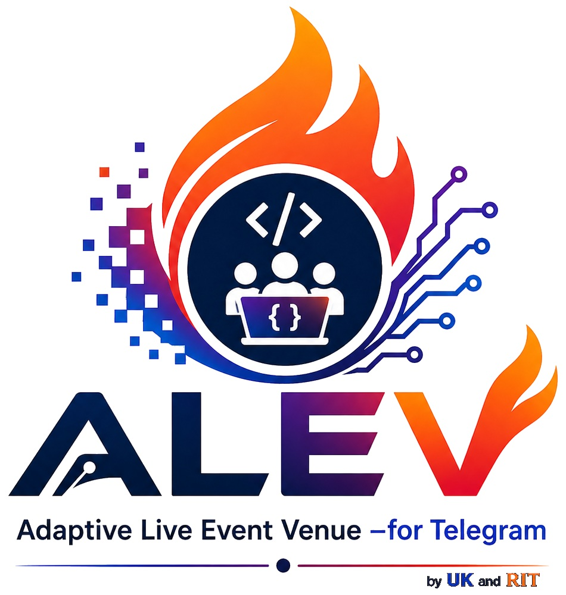
</p>

<h1 align="center">ALEV — Adaptive Live Event Venue for Telegram</h1>

<p align="center">
  <strong>A gamification and event management platform that turns Telegram into a competitive RPG arena for hackathons, innovation challenges, and team events.</strong>
</p>

<p align="center">
  
  
  
  
  
  
</p>

<p align="center">
  <em>Developed by <a href="https://github.com/utkukose">Prof. Dr. Utku Köse</a> &nbsp;·&nbsp; SDU Robotics and Innovation Community (RIT)</em>
</p>

---

## Table of Contents

- [Overview](#overview)
- [Key Features](#key-features)
- [Screenshots](#screenshots)
- [System Architecture](#system-architecture)
- [Project Structure & Code Reference](#project-structure--code-reference)
- [Event Structure: The RPG Framework](#event-structure-the-rpg-framework)
- [Scoring Mechanism](#scoring-mechanism)
- [Telegram Bot](#telegram-bot)
- [Admin Panel](#admin-panel)
- [User Flows](#user-flows)
- [Installation](#installation)
- [Multilingual Support](#multilingual-support)
- [Themes](#themes)
- [Security](#security)
- [Roadmap & Future Development](#roadmap--future-development)
- [License](#license)

---

## Overview

ALEV transforms traditional hackathons and innovation events into immersive, gamified experiences. Participants join as RPG characters with unique roles and attributes, complete structured tasks within narrative scenarios, and compete on live leaderboards — all through Telegram.

Administrators manage everything from a sleek web panel: defining RPG attributes, creating roles, building scenario-task hierarchies, approving submissions, and broadcasting announcements to all teams simultaneously.

---

## Key Features

| Feature | Description |
|---|---|
| 🎮 **RPG Gamification** | Custom attributes, roles with bonuses, and level progression |
| 📱 **Telegram-First** | All participant interactions happen via Telegram bot commands |
| 🗺️ **Scenario System** | Multi-stage event narratives with linked tasks |
| ✅ **Task Approval** | Admin reviews submissions with evidence links; SP awarded on approval |
| 🏆 **Live Leaderboard** | Real-time WebSocket-powered team rankings |
| 📢 **Announcements** | Broadcast messages to all groups or selected teams |
| 🌐 **Bilingual** | Full Turkish and English support across all interfaces |
| 🎨 **5 Themes** | Dark, Light, Ocean, Forest, Ember |
| 🔒 **Security** | JWT auth, httponly cookies, parameterized SQL, XSS protection |
| 🐳 **Docker-Ready** | One-command deployment with Docker Compose |

---

## Screenshots

### Admin Panel — Event Management

The admin panel is the control center for the entire event. From here you define the RPG framework, manage teams, review task submissions, and send announcements.

<table>
  <tr>
    <td align="center">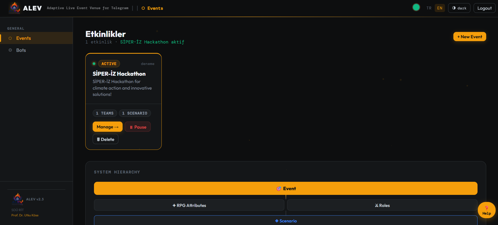<br/><sub><b>Event list</b> — all events at a glance with status indicators and quick actions</sub></td>
    <td align="center">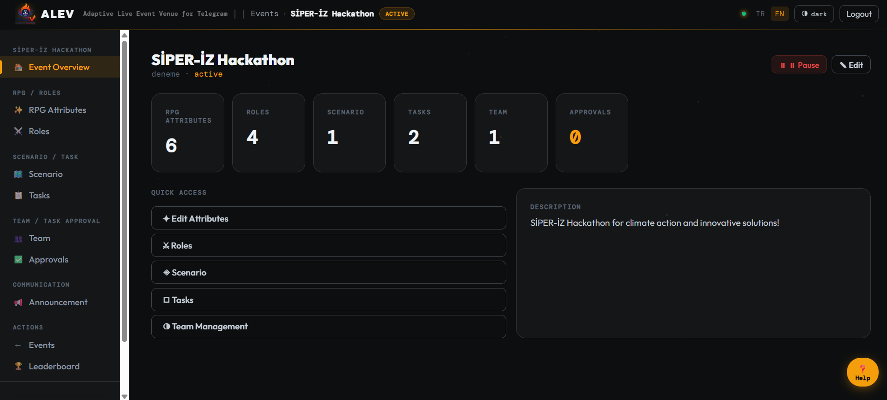<br/><sub><b>Event detail panel</b> — the 8-section tab interface for RPG setup, scenarios, teams, and communication</sub></td>
  </tr>
</table>

### RPG Framework — Attributes & Roles

Admins define custom RPG attributes (e.g., Strength, Eco Score, Intelligence) and roles with unique starting stats and task bonus multipliers. This forms the core of the scoring system.

<table>
  <tr>
    <td align="center">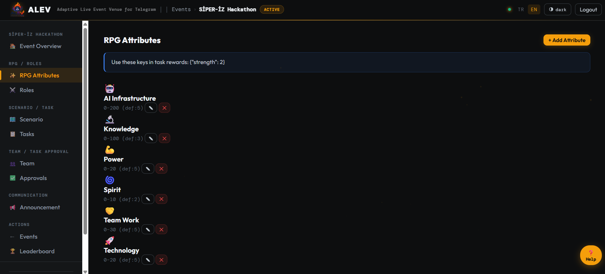<br/><sub><b>RPG Attributes</b> — define custom stats with emoji, min/max values, and default scores</sub></td>
    <td align="center">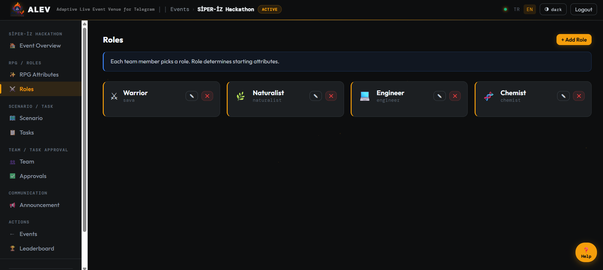<br/><sub><b>Role management</b> — each role carries starting attribute values and bonus multipliers for specific task types</sub></td>
  </tr>
</table>

### Scenarios & Tasks

Scenarios organize the event into narrative phases. Tasks are linked to scenarios and only become visible when their scenario is activated — keeping participants focused on the current phase.

<table>
  <tr>
    <td align="center">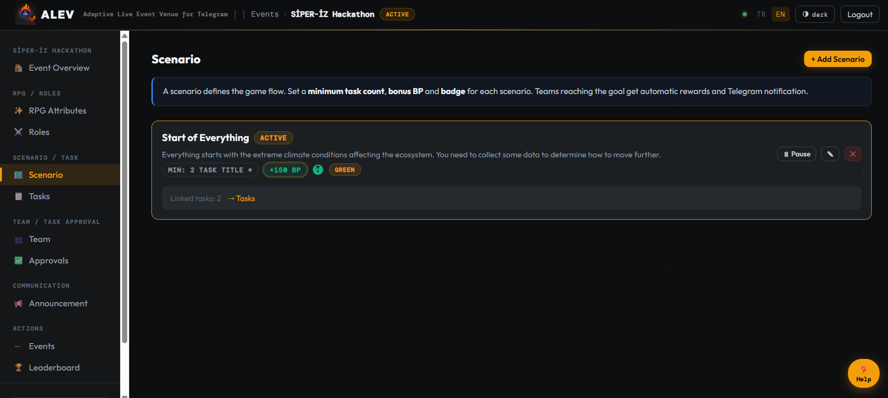<br/><sub><b>Scenario management</b> — create phases, set completion bonuses, and control activation timing</sub></td>
    <td align="center">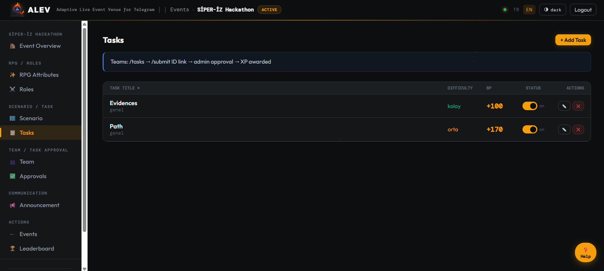<br/><sub><b>Task management</b> — tasks carry SP rewards, attribute bonuses (JSON), difficulty ratings, and scenario links</sub></td>
  </tr>
</table>

### Team Management & Task Approvals

Teams are created with unique invite codes and linked to Telegram groups. When a participant submits a task, it lands in the approval queue — the admin reviews the evidence link and approves or rejects with one click.

<table>
  <tr>
    <td align="center">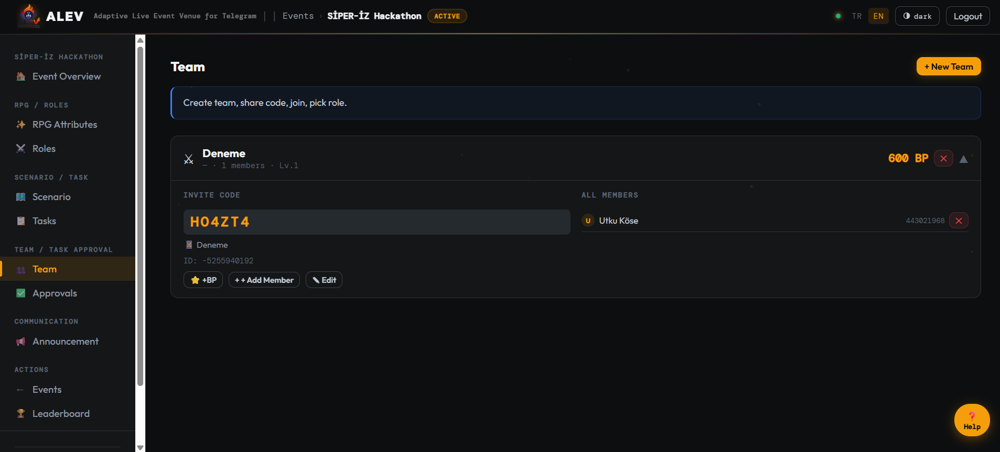<br/><sub><b>Team details</b> — member list with roles, SP totals, attributes, and Telegram group linkage</sub></td>
    <td align="center">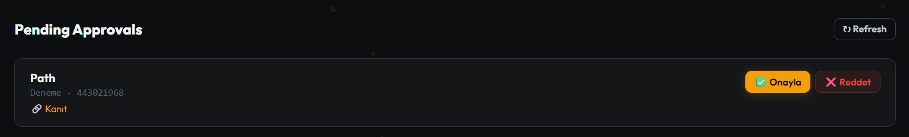<br/><sub><b>Task approval queue</b> — pending submissions with evidence links; approve to award SP automatically</sub></td>
  </tr>
</table>

### Public Pages — Leaderboard & Onboarding

The leaderboard is a public, real-time page designed for projection during events. The onboarding page guides new participants through a 4-step registration flow.

<table>
  <tr>
    <td align="center">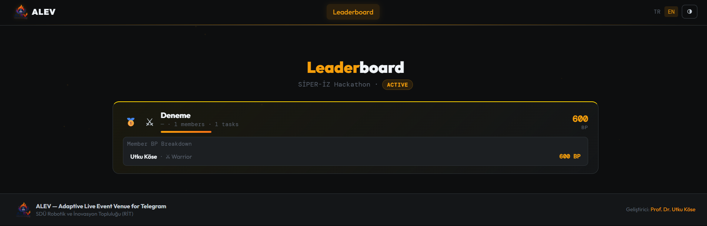<br/><sub><b>Live leaderboard</b> — WebSocket-powered real-time rankings with expandable team member SP breakdown</sub></td>
    <td align="center">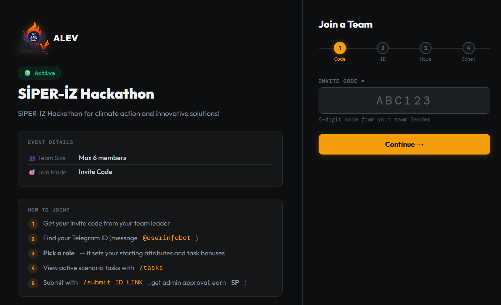<br/><sub><b>Participant onboarding</b> — invite code → Telegram ID → display name → role selection, all in one guided flow</sub></td>
  </tr>
</table>

### Telegram Bot in Action

Participants interact entirely through Telegram. The bot guides them from joining a team, selecting a role, browsing tasks, and submitting evidence — all without leaving the messaging app.

<table>
  <tr>
    <td align="center">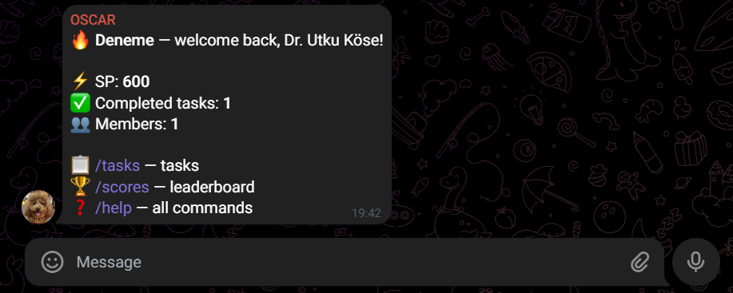<br/><sub><b>/start</b> — personalized welcome with team name, role, and current SP bar</sub></td>
    <td align="center">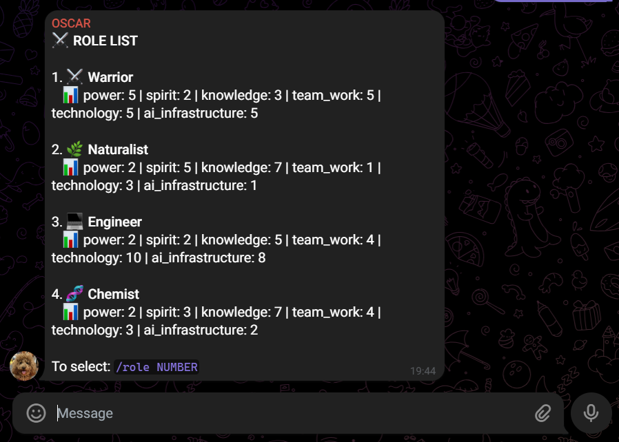<br/><sub><b>/role_list</b> — available roles displayed with attribute bonuses and specialty descriptions</sub></td>
  </tr>
  <tr>
    <td align="center">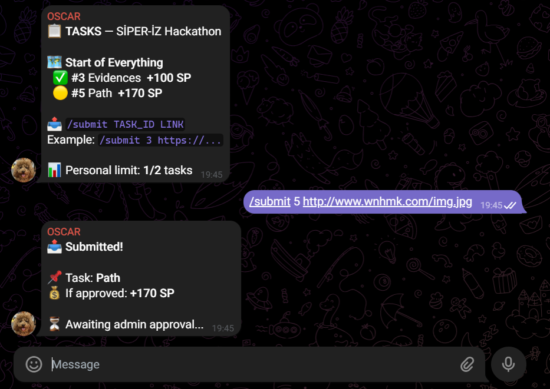<br/><sub><b>/submit</b> — confirmation message after submitting a task with evidence link</sub></td>
    <td align="center">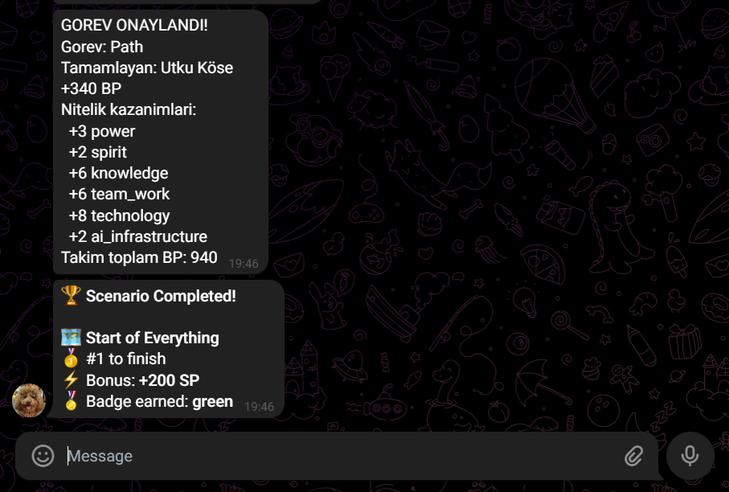<br/><sub><b>Approval notification</b> — SP awarded, attribute changes, and updated team total sent to the group</sub></td>
  </tr>
  <tr>
    <td align="center">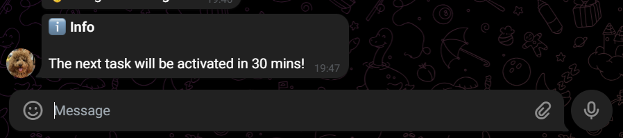<br/><sub><b>Admin broadcast</b> — announcements delivered with type emoji (ℹ️ info, ⚠️ warning, ✅ success)</sub></td>
    <td align="center">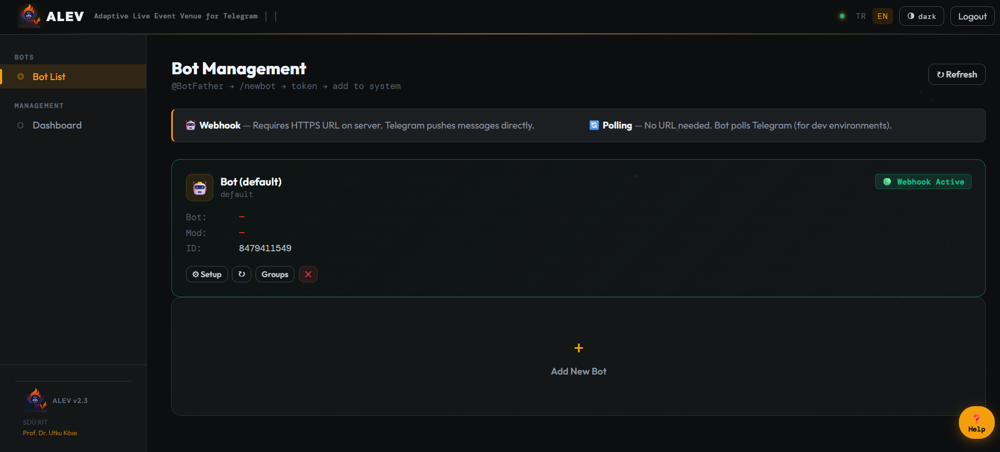<br/><sub><b>Bot management panel</b> — add bot token, configure webhook URL, monitor connection status</sub></td>
  </tr>
</table>

### 5 Built-in Themes

ALEV ships with five color themes switchable from the admin top bar. Theme preference is saved per browser session.

<table>
  <tr>
    <td align="center"><br/><sub>🌑 <b>Dark</b><br/>Deep charcoal + amber</sub></td>
    <td align="center">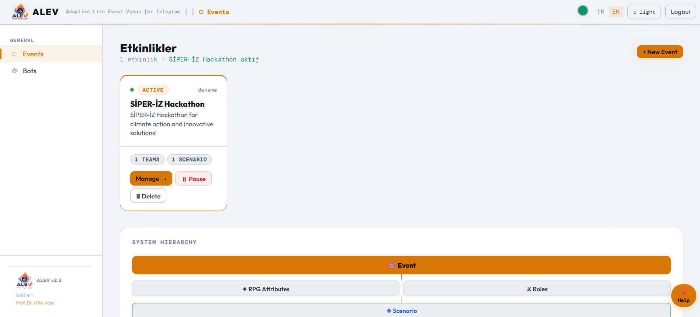<br/><sub>☀️ <b>Light</b><br/>Clean white + warm amber</sub></td>
    <td align="center">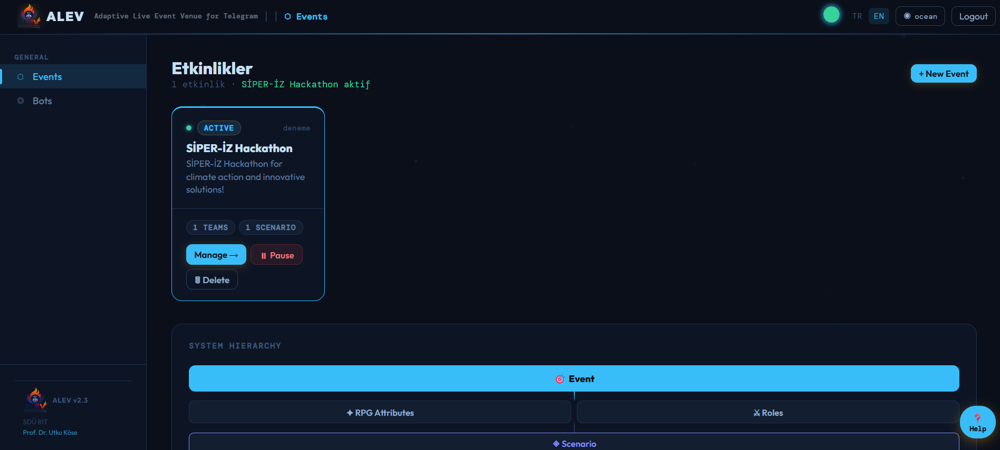<br/><sub>🌊 <b>Ocean</b><br/>Deep navy + cyan</sub></td>
    <td align="center">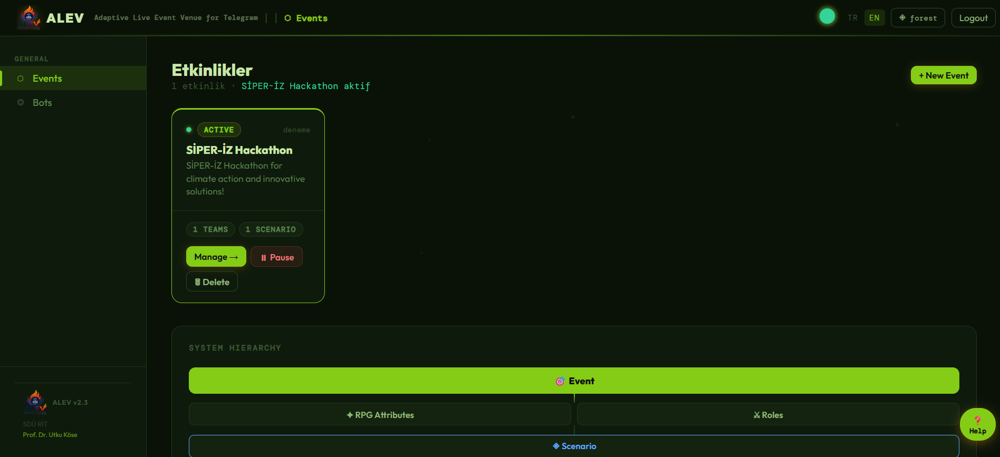<br/><sub>🌿 <b>Forest</b><br/>Dark green + lime</sub></td>
    <td align="center">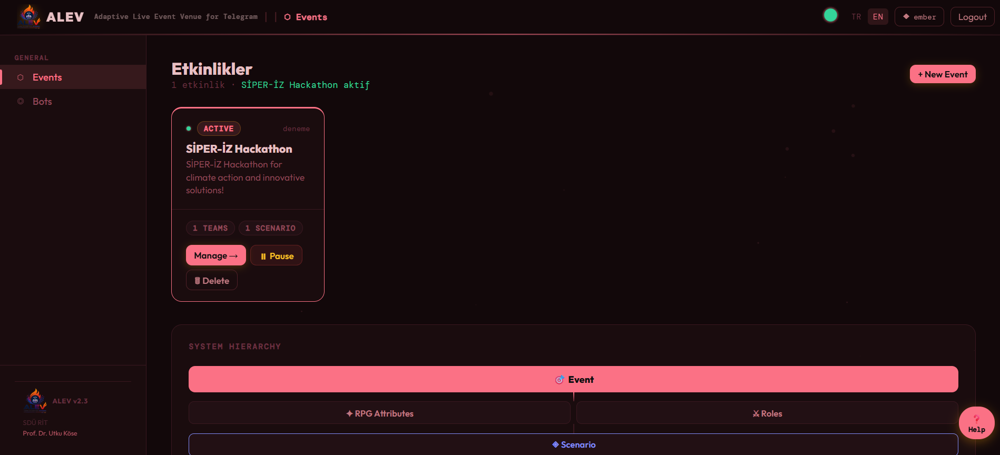<br/><sub>🔥 <b>Ember</b><br/>Deep crimson + rose</sub></td>
  </tr>
</table>

---

## System Architecture

```
┌─────────────────────────────────────────────────────────┐
│                        ALEV v2                          │
├──────────────┬──────────────────────┬───────────────────┤
│  Admin Panel │   Telegram Bot       │  Public Pages     │
│  /admin      │   (Webhook)          │  /leaderboard     │
│  FastAPI +   │   Async handlers     │  /profile         │
│  Jinja2      │   per group          │  /onboard         │
├──────────────┴──────────────────────┴───────────────────┤
│                  FastAPI Application                     │
│              WebSocket (real-time updates)               │
├─────────────────────────┬───────────────────────────────┤
│      PostgreSQL         │         Bot Container         │
│  Events, Teams,         │  Telegram webhook listener    │
│  Tasks, Members,        │  Async message handler        │
│  Completions, SP log    │  Per-group routing            │
└─────────────────────────┴───────────────────────────────┘
```

| Layer | Technology |
|---|---|
| Backend | Python 3.12, FastAPI, asyncpg |
| Database | PostgreSQL 15 |
| Templates | Jinja2 |
| Real-time | WebSockets |
| Bot | python-telegram-bot (async) |
| Auth | JWT (python-jose), bcrypt |
| Deployment | Docker Compose |

---

## Project Structure & Code Reference

```
alev/
├── README.md
├── LICENSE
├── .env.example
├── .gitignore
├── docker-compose.yml
├── Dockerfile
├── requirements.txt
├── bot.py                       ← Bot entry point
├── bot_runner.py                ← Bot process manager
│
├── docs/
│   ├── ALEV_logo.jpg
│   └── screenshots/             ← 21 UI screenshots
│
├── core/                        ← Core business logic (fully integrated)
│   ├── db.py                    ← Async DB layer (asyncpg)
│   ├── schema.sql               ← PostgreSQL schema
│   ├── bot_handler.py           ← Telegram command handlers
│   ├── bot_i18n.py              ← Bot TR/EN translations
│   ├── bot_registry.py          ← Multi-bot token management
│   ├── game_engine.py           ← SP/attribute calculation engine
│   ├── config_loader.py         ← YAML config reader
│   └── yaml_manager.py          ← YAML management utilities
│
├── web/                         ← FastAPI web application (fully integrated)
│   ├── app.py                   ← Main FastAPI app, WebSocket, webhook
│   ├── auth.py                  ← JWT authentication
│   ├── i18n.py                  ← Admin panel TR/EN translations
│   ├── bot_api.py               ← Bot API bridge
│   ├── yaml_api.py              ← YAML editor API
│   ├── api/
│   │   ├── events.py            ← Event CRUD
│   │   ├── teams.py             ← Team & member management
│   │   ├── content.py           ← Tasks, scenarios, announcements
│   │   └── bot.py               ← Bot management API
│   ├── templates/
│   │   ├── shared/
│   │   │   ├── base.html        ← Public base template
│   │   │   └── admin_base.html  ← Admin base (topbar, sidebar, themes)
│   │   ├── admin/               ← Admin panel pages
│   │   └── user/                ← Public pages (onboard, leaderboard, profile)
│   └── static/
│       ├── logo.png
│       ├── radar.js
│       └── badges/              ← SVG badge assets
│
├── bot_features/                ← Optional bot extensions (⚠ in development)
│   ├── quiz.py                  ← Telegram native quiz engine
│   ├── scheduler.py             ← Scheduled messages & auto-scenarios
│   ├── branching_scenario.py    ← Decision-tree narrative paths
│   ├── location_tasks.py        ← GPS-based task verification
│   ├── inline_mode.py           ← Telegram inline query support
│   ├── channel_sync.py          ← Public channel mirroring
│   └── code_eval/               ← Automated code assessment engine
│       ├── evaluator.py         ← 4-dimensional code scoring
│       └── bot_handler.py       ← Code eval bot integration
│
├── bot_locales/                 ← Bot translation JSON files
│   ├── tr.json
│   └── en.json
│
└── config/                      ← YAML configuration files
    ├── brand.yaml               ← Platform name & display settings
    ├── events.yaml
    ├── attributes.yaml
    ├── roles.yaml
    ├── scenarios.yaml
    ├── tasks.yaml
    ├── groups.yaml
    ├── actions.yaml
    ├── quizzes.yaml             ← For bot_features/quiz.py
    ├── branching_scenarios.yaml ← For bot_features/branching_scenario.py
    └── location_tasks.yaml      ← For bot_features/location_tasks.py
```

### `core/` — Core Business Logic

#### `core/db.py` — Async Database Layer

All database operations use `asyncpg` with fully parameterized queries (`$1`, `$2`, ...) — no string interpolation, no SQL injection risk. Key functions:

```python
await db.event_active()                              # Get currently active event
await db.team_by_tg(tg_id, event_id)               # Find team by Telegram ID
await db.member_add(team_id, data)                  # Add member with starting attributes
await db.task_list(event_id, active_only=True)      # Tasks visible to participants
await db.completion_create(team_id, task_id, ...)   # Submit a task
await db.completion_review(cid, status, sp, attrs)  # Approve or reject
await db.leaderboard(event_id)                       # Ranked teams with SP totals
```

Every SP transaction is also written to `member_bp_log` for full auditability.

#### `core/game_engine.py` — SP & Attribute Calculation Engine

Implements the RPG scoring logic as a stateless engine decoupled from the database. Operates on plain data objects — independently testable.

```python
# AttributeEngine: apply task completion effects to member stats
new_stats = engine.apply_action(
    action_type="task_complete",
    current_stats={"intelligence": 5, "eco": 10},
    task_type="analysis",
    stage_mult=1.2        # scenario stage multiplier
)

# ScenarioEngine: manage scenario progression
result: StageAdvanceResult = scenario_engine.advance_stage(scenario_id, team_stats)
# result.announcement_tr / result.announcement_en → sent to Telegram groups
# result.xp_bonus → bonus SP for reaching milestone

# Radar chart data for profile page
radar = engine.radar_data(member_stats)
# → [{"key": "eco", "label": "Eco Score", "value": 45, "max": 100, "pct": 45}, ...]
```

#### `core/bot_handler.py` — Telegram Command Handlers

Each command is an async function. The handler reads the group's event configuration on every message, enabling multiple bots with different languages and events on the same server.

```python
handlers = {
    "/start": _cmd_start,   "/join": _cmd_join,
    "/role_list": _cmd_role_list,  "/role": _cmd_role,
    "/scenarios": _cmd_scenarios,  "/tasks": _cmd_tasks,
    "/submit": _cmd_submit,        "/profile": _cmd_profile,
    "/status": _cmd_status,        "/scores": _cmd_scores,
    "/help": _cmd_help,
}
```

Task submission validation chain:
1. Member must belong to a team
2. Member must have a role selected
3. Task must be valid and in the active scenario
4. Task must not have been submitted before by this member
5. Per-member task limit must not be exceeded

#### `core/bot_registry.py` — Multi-Bot Token Management

- Tokens are **Fernet-encrypted** (AES-128-CBC + HMAC) before DB storage
- On registration: verifies token via `getMe()`, sets command menus in TR/EN, configures webhook
- Supports multiple bots simultaneously, each linked to a different event

---

### `web/` — FastAPI Web Application

#### `web/app.py` — Main Application

```python
# Router registration
app.include_router(events_router,  prefix="/api/events")
app.include_router(teams_router,   prefix="/api/teams")
app.include_router(content_router, prefix="/api/content")
app.include_router(bot_router,     prefix="/api/bot")

# WebSocket — admin receives live task submission alerts
@app.websocket("/ws/{channel}")
async def websocket_endpoint(ws: WebSocket, channel: str): ...

# Telegram webhook — routes to bot_handler by group_id
@app.post("/webhook/{group_id}")
async def telegram_webhook(group_id: str, request: Request): ...
```

#### `web/api/teams.py` — Team & Member API

Notable design decisions:
- `POST /api/teams/{tid}/members` — checks for duplicate Telegram IDs before inserting; returns HTTP 409 if already a member
- `GET /api/teams/{tid}/members` — requires admin JWT **or** a valid `profile_teamid` cookie (set by the team profile login)
- `POST /api/teams/completions/{cid}/review` — calculates final SP with role bonuses, updates attributes, triggers Telegram notification, broadcasts leaderboard update via WebSocket

#### `web/i18n.py` — Admin Panel Translations

All UI text defined as nested Python dicts for zero-overhead runtime access. Returns a `SimpleNamespace` tree:

```python
t = get_t(request)
# In Jinja2 templates:
# {{ t.event_detail.tasks }}  →  "Görevler" or "Tasks"
# {{ t.common.save }}         →  "Kaydet" or "Save"
```

#### `web/templates/` — Jinja2 Template Hierarchy

`event.html` implements a single-page tab system: all 8 sections (Overview, Attributes, Roles, Scenarios, Tasks, Teams, Approvals, Communication) are rendered server-side and shown/hidden via `showSec()` without page reloads. This keeps the page fast while maintaining full Jinja2 rendering for data.

---

### `bot_features/` — Optional Bot Extensions

> ⚠️ **These modules are under active development.** Not yet fully integrated into the main event flow. They are provided as extensibility examples and will be promoted to core features in future releases.

#### `bot_features/code_eval/evaluator.py` — Source Code Evaluation Engine

Four-dimensional automated assessment, zero LLM dependency:

```python
OutputComparator    # Runs code in sandbox, compares stdout to reference
ASTSimilarity       # Abstract syntax tree comparison — detects algorithmic similarity
QualityAnalyzer     # Cyclomatic complexity, comment ratio, naming quality
PlagiarismDetector  # TF-IDF + AST token fingerprinting for copy detection
# All evaluators return 0–100 scores
```

Designed to integrate with task submission: when a participant submits a GitHub link, the evaluator scores the code before placing it in the admin approval queue.

#### `bot_features/quiz.py` — Telegram Quiz Engine

Runs native Telegram polls as knowledge quizzes. Uses Telegram's built-in `Poll` type in quiz mode — correct answers are revealed automatically, and the bot captures responses to award SP. Quiz definitions live in `config/quizzes.yaml`.

#### `bot_features/scheduler.py` — Scheduled Messages

Powered by `APScheduler`:
- Auto-activate scenarios when `starts_at` is reached
- Warning messages X minutes before a stage ends
- Periodic leaderboard broadcasts (e.g., top 3 every hour)
- Pre-event countdowns to all registered groups

#### `bot_features/branching_scenario.py` — Decision Tree Scenarios

Each team follows a different narrative path based on their choices via Telegram inline keyboards:

```
Bot: "Which domain will your team focus on?"
     [💧 Water Ecosystems]  [⚡ Renewable Energy]  [🌱 Urban Farming]
→ Team taps → that branch's tasks unlock, others stay hidden
→ Each branch has different SP rewards and attribute bonuses
```

#### `bot_features/location_tasks.py` — GPS Task Verification

Participants share their Telegram location. The bot checks coordinates against a target location within a configurable tolerance (meters) and auto-approves on match.

---

## Event Structure: The RPG Framework

```
Event
├── Attributes  (Strength, Intelligence, Eco Score, ...)
├── Roles       (Researcher, Engineer, Guardian, ...)
├── Scenarios   (Phase 1: Analysis → Phase 2: Build → ...)
│   └── Tasks   (linked to the active scenario)
└── Teams
    └── Members (each selects a role on joining)
```

### Attributes

Custom RPG stats defined per event:

```json
{
  "key": "eco",
  "name_tr": "Çevre Puanı",
  "name_en": "Eco Score",
  "emoji": "🌱",
  "min_val": 0,
  "max_val": 100,
  "default_val": 10
}
```

### Roles

Each role carries starting attributes and bonus multipliers for specific task types:

| Role | Starting Attributes | Task Bonus |
|---|---|---|
| 🔬 Researcher | Intelligence +8 | x1.4 on analysis tasks |
| ⚔️ Engineer | Strength +6, Intelligence +4 | x1.3 on build tasks |
| 🌿 Guardian | Eco Score +15 | x1.5 on sustainability tasks |

**Role selection is mandatory** before submitting any task.

### Scenarios & Tasks

Only one scenario is active at a time. Activating a scenario automatically notifies all team Telegram groups. Tasks are only visible and submittable when their parent scenario is active:

```
Scenario: "Phase 1 — Problem Analysis"  [ACTIVE]
  ├── Task #1: Stakeholder interviews          [50 SP]
  ├── Task #2: Market analysis report          [80 SP]
  └── Task #3: System flow diagram             [60 SP]

Scenario: "Phase 2 — Solution Design"   [UPCOMING]
  └── Task #4: System architecture             [100 SP]
```

---

## Scoring Mechanism

### Formula

```
Final SP = Base SP × Role Bonus Multiplier + Scenario Completion Bonus
```

**Example:**
```
Task:         "Conduct stakeholder analysis"  →  Base SP: 80
Task rewards: {"intelligence": 3}
Member role:  Researcher  (intelligence specialty → x1.4)
Final SP:     80 × 1.4 = 112 SP
```

**Scenario bonus:** when a team completes the minimum required tasks, a flat bonus is awarded. The **first team** to reach this milestone gets an additional "first completion" bonus.

**SP distribution:** added to both the individual member and the team total simultaneously. Every transaction is logged in `member_bp_log`.

### Approval Flow

```
Member: /submit 3 https://github.com/team/repo
        ↓
Validation: role assigned? task active? not already submitted? limit ok?
        ↓
Admin receives WebSocket alert → reviews evidence link
        ↓
    ✓ Approve                          ✗ Reject
        ↓                                  ↓
SP added to member & team          Rejection notification
Attributes updated                 sent to Telegram group
Telegram group notified
Leaderboard updated (WebSocket)
```

---

## Telegram Bot

### Bot Commands

| Command | Description |
|---|---|
| `/start` | Welcome message and current status |
| `/join <CODE>` | Join a team using invite code |
| `/role_list` | List available roles with descriptions |
| `/role <NUM>` | Select or change your role |
| `/scenarios` | View the active scenario |
| `/tasks` | List tasks in the active scenario |
| `/submit <ID> <LINK>` | Submit a task with evidence link |
| `/profile` | Personal SP, attributes, and stats |
| `/status` | Team total SP and member list |
| `/scores` | Leaderboard ranking |
| `/help` | All available commands |

> All commands work in both English and Turkish. Language is configured per event.

### Bot Setup with Ngrok

Ngrok is ideal for development, testing, or short-term events.

```bash
# Install
curl -sSL https://ngrok-agent.s3.amazonaws.com/ngrok.asc | sudo tee /etc/apt/trusted.gpg.d/ngrok.asc >/dev/null
echo "deb https://ngrok-agent.s3.amazonaws.com buster main" | sudo tee /etc/apt/sources.list.d/ngrok.list
sudo apt update && sudo apt install ngrok -y

# Authenticate (sign up at ngrok.com)
ngrok config add-authtoken YOUR_TOKEN_HERE

# Start persistent tunnel (survives SSH disconnect)
screen -S ngrok
ngrok http 8000
# Ctrl+A then D to detach from screen
```

Copy the `https://xxxx.ngrok-free.app` URL → Admin Panel → Bot Management → Webhook URL.

> ⚠️ Ngrok free tier assigns a new URL each restart. Update the webhook URL after every restart.

### Bot Setup with a Domain

```bash
sudo apt install certbot python3-certbot-nginx -y
sudo certbot --nginx -d yourdomain.com
```

```nginx
server {
    listen 443 ssl;
    server_name yourdomain.com;
    location / {
        proxy_pass http://127.0.0.1:8000;
        proxy_http_version 1.1;
        proxy_set_header Upgrade $http_upgrade;
        proxy_set_header Connection "upgrade";
        proxy_set_header Host $host;
    }
}
```

---

## Admin Panel

| Section | Capabilities |
|---|---|
| **Overview** | Event stats, system hierarchy, quick actions |
| **RPG / Attributes** | Define custom attributes with emoji, min/max values |
| **RPG / Roles** | Create roles with starting attributes and bonus multipliers |
| **Scenario** | Create, activate/deactivate scenarios, set completion bonuses |
| **Tasks** | Add tasks with SP rewards, attribute bonuses, difficulty, type |
| **Teams** | Create teams, manage members, link Telegram groups |
| **Approvals** | Review and approve/reject task submissions |
| **Communication** | Broadcast to all or selected team groups |
| **Bot Management** | Add token, configure webhook, monitor status |

---

## User Flows

### Participant Onboarding
```
1. Get invite code from team leader
2. Visit /onboard → enter invite code
3. Enter Telegram ID (from @userinfobot)
4. Enter display name and username
5. Select a role from the list
6. ✓ Joined — all Telegram commands are now active
```

### Task Submission
```
/tasks                            → View active tasks with IDs and SP rewards
/submit 3 https://github.com/…   → Submit with evidence link
Admin approves → SP awarded → Telegram group notified
```

---

## Installation

### Prerequisites
- Docker Engine 24+
- Docker Compose v2+
- Server with outbound HTTPS (for Telegram webhook)

### Quick Start
```bash
git clone https://github.com/utkukose/alev.git
cd alev
cp .env.example .env
nano .env           # Fill in required values
docker compose up --build -d
docker compose logs -f web
```

Admin panel: `http://localhost:8000/admin`

### Environment Variables

| Variable | Required | Description |
|---|---|---|
| `ADMIN_USERNAME` | ✓ | Admin panel username |
| `ADMIN_PASSWORD` | ✓ | Admin panel password |
| `SECRET_KEY` | ✓ | JWT signing key (32+ random chars) |
| `TOKEN_ENCRYPTION_KEY` | — | Bot token encryption (recommended) |
| `INTERNAL_SECRET` | — | Internal service auth (recommended) |

> ⚠️ The system **will not start** without a valid `.env` file. Default passwords have been intentionally removed.

---

## Multilingual Support

- **Admin Panel** — language switcher in top bar
- **Telegram Bot** — language set per event; all responses in configured language
- **Public Pages** — language preference stored in cookie
- **SP Terminology** — Turkish: **BP** (Battle Point) · English: **SP** (Skill Point)

---

## Themes

| Theme | Style |
|---|---|
| 🌑 **Dark** | Deep charcoal with amber accents (default) |
| ☀️ **Light** | Clean white with warm amber accents |
| 🌊 **Ocean** | Deep navy with cyan highlights |
| 🌿 **Forest** | Dark green with lime accents |
| 🔥 **Ember** | Deep crimson with rose highlights |

Theme preference is saved in localStorage and persists across sessions.

---

## Security

| Area | Implementation |
|---|---|
| Authentication | JWT tokens, httponly cookies, 8-hour session |
| SQL Injection | Fully parameterized queries (`$1`, `$2`, ...) via asyncpg |
| XSS Protection | Jinja2 auto-escaping + `escapeHtml()` for all dynamic DOM insertion |
| Bot Tokens | Fernet-encrypted at rest (AES-128-CBC + HMAC) |
| Internal API | Protected by `X-Internal-Secret` header |
| Default Passwords | Removed — system refuses to start without `.env` |
| Team Profile | Invite code + username auth, httponly session cookie |

---

## Roadmap & Future Development

### 🤖 AI-Powered Features
- **AI Task Evaluator** — LLM-based pre-scoring of submissions (code, documents, demos) before admin review
- **Code Analysis Integration** — automatic quality metrics via `bot_features/code_eval/` *(in development)*
- **Smart Role Recommendation** — suggest roles based on participant profile and event context

### 💬 Communication Enhancements
- **Native In-System Messaging** — built-in team chat that doesn't require Telegram, enabling ALEV to operate as a fully self-contained platform
- **Multi-Channel Notifications** — extend broadcasts to email, Discord, and Slack
- **Scheduled Announcements** — time-delayed broadcasts via `bot_features/scheduler.py` *(in development)*
- **Channel Sync** — mirror announcements to public channels via `bot_features/channel_sync.py` *(in development)*

### ⚖️ Jury System *(in active development)*

A dedicated jury evaluation layer is being developed alongside the task-based SP system. The infrastructure is already in place:

- **`web/api/jury.py`** — REST API for score submission, session management, and member administration. Jury members authenticate with their Telegram ID and receive a session token.
- **`web/templates/jury/panel.html`** — A separate public-facing jury panel (`/jury`) where authorized jury members score each team on RPG attributes (0–100 per criterion) without needing admin access.
- **`config/jury.yaml`** — Configurable jury criteria with individual weights (Innovation 30%, Environmental Impact 35%, Feasibility 20%, Presentation 15%), SP/jury score blend ratio, and jury member Telegram ID list.
- **DB tables** — `jury_criteria`, `jury_members`, `jury_scores`, `jury_sessions` are fully defined in `schema.sql`.

**Current state:** Score saving, session auth, and Telegram notification on full scoring are working. Pending integration items:

- **Admin UI for jury management** — the jury criteria list and "Add Criterion" button were removed from the event management panel in v2.3 pending a redesign; criteria are currently configured via `config/jury.yaml`
- **Jury panel link** — the `/jury` page exists and is functional, but there is no navigation button in the admin panel to open or share it with jury members; the URL must be shared manually
- **Weighted final score blending** — the `jury_weight` / `xp_weight` config in `jury.yaml` is defined but not yet applied to the leaderboard; jury scores and task SP are currently tracked independently
- **Jury section in event management** — the sidebar entry and section were present in earlier versions but removed from `event.html` v2.3 along with jury-related API calls; re-integration is planned with a cleaner UX

**Planned jury flow:**
```
Admin defines criteria in jury.yaml (or future admin UI)
        ↓
Admin shares /jury?event_id=X link with jury members
        ↓
Jury members enter Telegram ID → receive session token
        ↓
Score each team on each criterion (0–100)
        ↓
On full completion → team receives Telegram notification
        ↓
Final score = (Task SP × xp_weight%) + (Jury score × jury_weight%)
        ↓
Unified leaderboard reflects blended ranking
```

### 🎮 Deeper Gamification
- **Branching Narrative Scenarios** — decision-tree driven event paths via `bot_features/branching_scenario.py` *(in development)*
- **Location-Based Tasks** — GPS-verified task completion via `bot_features/location_tasks.py` *(in development)*
- **Telegram Quiz Engine** — native quiz competitions via `bot_features/quiz.py` *(in development)*
- **Telegram Inline Mode** — query tasks and scores from any chat via `bot_features/inline_mode.py` *(in development)*
- **Achievement System** — unlockable badges for milestones with Telegram sticker rewards
- **Inter-Team Challenges** — bot-mediated direct challenges between teams

### 📊 Analytics & Reporting
- **Event Analytics Dashboard** — task completion rates, peak activity, role performance heatmaps
- **Automated Post-Event Report** — PDF/DOCX generation with rankings and contribution timelines
- **Real-Time Activity Feed** — live stream of submissions and SP changes for event projection screens

### 🏗️ Platform Extensions
- **Multi-Event Management** — organization-level accounts managing multiple simultaneous events
- **Template System** — save and reuse event configurations across events
- **Public API** — RESTful API for integration with LMS systems and university portals
- **Legacy Bot (`bot.py`)** — an earlier single-group bot implementation exists in `bot.py` alongside the current multi-bot `bot_runner.py`. It uses a separate DB schema (`feedback_schema.sql`, `core/db.py` legacy functions) and is not connected to the v2 admin panel. It is preserved as a reference for migration and eventual deprecation.
- **Dashboard (`admin/dashboard.html`)** — a separate dashboard page exists with Duel & SP, Scenario, and Announcement management sections. It is not linked from the main admin navigation and is under evaluation for merging into the main event management panel.
- **YAML Editor (`admin/yaml_editor.html`)** — a browser-based YAML editor backed by `web/yaml_api.py` allows editing config files directly from the admin panel. It is functional but not yet linked from the main navigation.
- **Participant Feedback (`core/feedback_schema.sql`)** — a task feedback/rating system (1–5 stars + comment) is defined at the DB schema level but has no UI or API implementation yet.
- **Mini App (`bot_features/mini_app.py`)** — Telegram Web App integration stub for a future in-app participant interface *(in development)*.
- **Task Buttons (`bot_features/task_buttons.py`)** — inline keyboard buttons for task actions directly within Telegram messages, without needing slash commands *(in development)*.

---

## License

MIT License — see [LICENSE](LICENSE) for details.

---

<p align="center">
  
  <br/>
  <strong>ALEV — Adaptive Live Event Venue for Telegram</strong>
  <br/>
  Developed by <a href="https://github.com/utkukose">Prof. Dr. Utku Köse</a> · SDU Robotics and Innovation Community (RIT)
</p>
